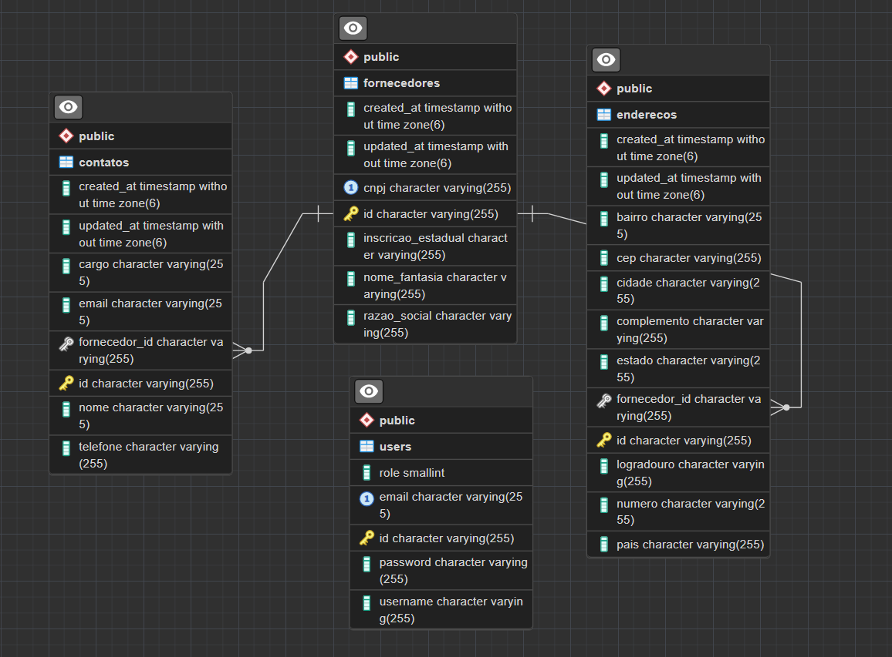

## Descrição do projeto

Esse é um sistema de gerenciamento de fornecedores simples no qual possui as seguintes funcionalidaes no backend são:

* Cadastrar fornecedor;
* Listar fornecedores cadastrados;
* Editar, visualizar e excluir fornecedores cadastrados.

Enquanto isso, o front-end deve utilizar a API desenvolvida no back-end para realizar as funcionalidades de cadastrar um novo fornecedor, listar fornecedores cadastrados, editar suas informações e excluir os fornecedores cadastrados.

<br>

<br>

## Tecnologias utilizadas

O back-end foi desenvolvido usando Spring Boot e o front-end foi desenvolvido usando React. O banco de dados utilizado foi o PostgreSQL.

<br>

## Modelagem do banco de dados
Inicialmente, eu busquei entender quais são as características e informações necessárias para um forncedor e decidi construir um modelo mais genérico com informações consideradas importantes para qualquer tipo de fornecedor. Dito isso, o modelo do banco de dados foi construído da seguinte forma:



O Banco contém uma tabela chamada de `fornecedores` na qual possui relação com a tabela `enderecos` e `contatos`. Além disso, tem uma tabela chamada `users` que armazena os dados dos usuários que terão acesso ao sistema. No sistema, um usuário pode ser `ADMIN` ou `USER`, onde o `ADMIN` tem acesso a todas as funcionalidades do sistema, enquanto o `USER` tem acesso apenas a listagem de fornecedores. Nesse sistema, todas as funcionalidades são restritas a usuários com perfil `ADMIN`, exceto o login.


<br>

## Desenvolvimento da aplicação

<br>

### Back-end

Primeiramente, comecei a desenvolver o sistema pelo back-end. Para isso, criei um projeto Spring Boot utilizando o [Spring Initializr](https://start.spring.io/). Em seguida, implementei os modelos de cada entidade do banco de dados, os repositórios, os serviços que foran citados na seção da Descrição do desafio e os controladores para cada um deles. Além disso, implementei uma série de tratamento de erros e exceções para garantir a integridade do sistema, seguindo as boas práticas de desenvolvimento, organização de código e entregando mensagens de erros mais claras para o usuário. 

Após finalizar a implementação das funcionalidades, realizei uma série de testes usando o Postman e o Insomnia para garantir que o sistema estava funcionando corretamente. Depois de realizar os testes da API, comecei a configurar a segurança do sistema. Para isso, utilizei o Spring Security para realizar a autenticação e autorização dos usuários, JWT para criar os tokens de acesso, além de configurar o CORS (Cross-Origin Resource Sharing) para permitir que o front-end possa acessar a API, finalizando assim o desenvolvimento do back-end.

As rotas da API são as seguintes:

* `POST auth/login`: Rota para realizar o login do usuário;
* `POST auth/register`: Rota para realizar o cadastro de um novo usuário; (autenticado)
* `GET api/fornecedores`: Rota para listar todos os fornecedores cadastrados;(autenticado)
* `POST api/fornecedor/{idFornecedor}`: Rota para cadastrar um novo fornecedor;(autenticado)
* `PUT api/fornecedor/`: Rota para editar um fornecedor;(autenticado)
* `DELETE /api/fonrecedor/{idFornecedor}`: Rota para excluir um fornecedor;(autenticado)
* `DELETE /api/enderecos/{idFornecedor}`: Rota para excluir um fornecedor;(autenticado)
* `PUT api/enderecos/{idFornecedor}`: Rota para visualizar um fornecedor;(autenticado)
* `POST /api/enderecos/{idFornecedor}`: Rota para visualizar um fornecedor;(autenticado)
* `GET /api/contatos/{idFornecedor}`: Rota para visualizar um fornecedor;(autenticado)
* `POST /api/contatos/{idFornecedor}`: Rota para visualizar um fornecedor;(autenticado)
* `PUT /api/contatos/{idFornecedor}`: Rota para visualizar um fornecedor;(autenticado)

<br>

### Front-end

Inicialmente, criei um projeto React utilizando o [Vite](https://vitejs.dev/) pois ele otimiza bastante a resposta do servidor, além de ser mais rápido que o Create React App. Em seguida, comecei a implementar as páginas da aplicação, utilizando o [Material-UI](https://mui.com/) para estilizar e utilizar seus componentes que auxiliam na implementação de páginas, aceleando o desenvolvimento. Além disso, utilizei o [React Router](https://reactrouter.com/) para realizar a navegação entre as páginas da aplicação, o [Axios](https://axios-http.com/) juntamente com o [React Query](https://react-query.tanstack.com/) para realizar as requisições HTTP para a API e o[Yup](https://github.com/jquense/yup) com o [Formik](https://formik.org/) para realizar a validação dos formulários.

Após finalizar a implementação das páginas e funcionalidades se comunicando com a API, comecei a implementar a segurança do sistema. Para isso implementei um AuthContext para armazenar as informações do usuário logado. Além disso, implementei um sistema de rotas privadas para garantir que apenas usuários autenticados possam acessar as páginas da aplicação. Por fim, implementei um sistema de tratamento de erros para garantir que o usuário receba mensagens de erros claras e objetivas.

<br>

## Docker

Para cada um dos serviços, eu criei um arquivo de configuração para construir uma imagem Docker montar containers para cada um dos serviços. No momento, só estou usando um container para o back-end, mas a ideia é que cada serviço tenha seu próprio container. Logo abaixo estão os arquivos Dockerfile para cada um dos serviços:

### Dockerfile do back-end

```Dockerfile
FROM maven:3.8.1-openjdk-17 AS build

WORKDIR /app

COPY pom.xml .
COPY src ./src

RUN mvn clean package -DskipTests

FROM openjdk:17-jdk-slim

WORKDIR /app

COPY --from=build /app/target/backend-0.0.1-SNAPSHOT.jar app.jar

EXPOSE 8080

ENTRYPOINT ["java", "-jar", "app.jar"]
```

### banco de dados PostgreSQL

No banco de dados PostgreSQL, eu utilizei a imagem oficial do PostgreSQL disponível no Docker Hub. a minha execução do container foi feita da seguinte forma:

```bash
docker run --name backend-sistema-fornecedores \
  --network sistema-fornecedores \
  -p 8080:8080 \
  -e SPRING_APPLICATION_NAME=backend \
  -e SPRING_DATASOURCE_URL=jdbc:postgresql://172.18.0.2:5432/sistema-fornecedores \
  -e SPRING_DATASOURCE_DRIVER_CLASS_NAME=org.postgresql.Driver \
  -e SPRING_DATASOURCE_USERNAME=postgres \
  -e SPRING_DATASOURCE_PASSWORD=postgres \
  -e SPRING_JPA_HIBERNATE_DDL_AUTO=update \
  -e FRONTEND_URL=https://desafio-insightlab-nu.vercel.app/ \
  -e API_TOKEN_SECRET=${JWT_SECRET:qwertyuiopasdfghjklzxcvbnm1234567890} \
  -d alyssonaraujo/backend-sistema-fornecedores:latest
```

### Dockerfile do front-end

```Dockerfile
FROM node:18 AS build

WORKDIR /app

COPY package*.json ./

RUN npm install

COPY . .

RUN npm run build

FROM nginx:alpine

WORKDIR /usr/share/nginx/html

COPY --from=build /app/dist .

EXPOSE 80

CMD ["nginx", "-g", "daemon off;"]
```

Recomendo criar 3 containers (Front-end, Back-end e o banco de dados) dentro de uma rede no Docker para que eles possam se comunicar entre si de uma maneira mais fácil.

<br>

## Conclusão e melhorias

A aplicação foi desenvolvida com sucesso e está funcionando corretamente. No entanto, ainda existem algumas melhorias que podem ser feitas para tornar a aplicação ainda melhor. Algumas delas são:

* Implementar testes automatizados no backend para garantir a integridade da API  mesmo que já haja testes feitos pelo próprio JpaRepository;
* Implementar testes automatizados no front-end para garantir a integridade da aplicação;
* Implementar um sistema de paginação na listagem de fornecedores para melhorar a performance da aplicação;
* Implementar um sistema de pesquisa para que o usuário possa buscar fornecedores pelo nome;
* Implementar um sistema de filtros para que o usuário possa filtrar fornecedores por categoria, cidade, estado, etc; 
  
<br>

## Contato

Caso tenha alguma dúvida ou sugestão, fique à vontade para entrar em contato comigo pelo e-mail
    alyssonaraujowork@gmail.com
 ou pelo meu perfil no [LinkedIn](https://www.linkedin.com/in/alysson-alexandre/).
